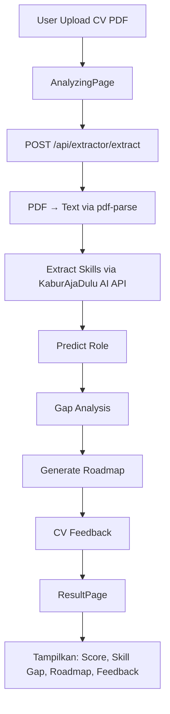

# KaburAjaDulu AI 🚀

Platform analisis CV berbasis AI yang membantu kamu mengidentifikasi *skill gap*, memprediksi role yang sesuai, dan membuat **roadmap karier** yang terstruktur — hanya dengan mengunggah CV dalam format PDF.

---

## ✨ Fitur Utama

| Fitur | Deskripsi |
|---|---|
| 📄 **Analisis CV** | AI mengekstrak skill, pengalaman, dan potensi dari CV kamu |
| 📊 **Skill Gap Detection** | Menemukan skill yang masih kurang dibandingkan standar industri |
| 🤖 **Prediksi Role** | Memprediksi role karier yang paling cocok berdasarkan skillset |
| 🚀 **Roadmap Karier** | Menghasilkan langkah belajar yang terstruktur dan diprioritaskan |
| 📝 **CV Feedback** | Memberikan skor ATS, readability, dan rekomendasi perbaikan CV |

---

## 🏗️ Arsitektur Proyek

Proyek ini adalah **monorepo** yang terdiri dari dua subproyek utama:

```
kabur-aja-dulu-ai-web/
├── kaburai-backend/      # REST API — Express.js + TypeScript
├── kaburai-frontend/     # Web App — React + Vite + Tailwind CSS
├── Makefile              # Shortcut perintah umum
└── package.json          # Root — menjalankan keduanya secara bersamaan
```

### Stack Teknologi

**Backend (`kaburai-backend`)**
- **Runtime:** Node.js 22
- **Framework:** Express.js v5
- **Bahasa:** TypeScript
- **Database:** PostgreSQL via [Drizzle ORM](https://orm.drizzle.team/)
- **Auth:** Supabase Auth
- **Upload:** Multer (PDF only)
- **PDF Parsing:** pdf-parse
- **Validasi:** Zod
- **Deployment:** Docker

**Frontend (`kaburai-frontend`)**
- **Framework:** React 19
- **Build Tool:** Vite
- **Styling:** Tailwind CSS v4
- **State Management:** Zustand
- **Form:** React Hook Form + Zod
- **HTTP Client:** Axios
- **Deployment:** Vercel

---

## 🔄 Alur Aplikasi



---

## 🚀 Cara Menjalankan Proyek Secara Lokal

### Prasyarat

Pastikan kamu sudah menginstal:

- [Node.js](https://nodejs.org/) v18+ (atau [Bun](https://bun.sh/) sebagai alternatif)
- [npm](https://www.npmjs.com/)
- Akun [Supabase](https://supabase.com/) (untuk Auth & Database)
- Akses ke **KaburAjaDulu AI API** (API internal untuk analisis CV)

---

### 1. Clone Repositori

```bash
git clone https://github.com/NaraMizaru/kabur-aja-dulu-ai-web.git
cd kabur-aja-dulu-ai-web
```

---

### 2. Konfigurasi Environment Variables

#### Backend — buat file `.env` di dalam `kaburai-backend/`

```bash
cp kaburai-backend/.env.example kaburai-backend/.env
```

> Jika file `.env.example` belum ada, buat file `kaburai-backend/.env` secara manual:

```env
# Supabase
SUPABASE_URL=https://<project-id>.supabase.co
SUPABASE_KEY=<your-supabase-anon-or-service-role-key>

# Database PostgreSQL (dari Supabase atau instance sendiri)
DATABASE_URL=postgresql://postgres:<password>@<host>:5432/<database>

# KaburAjaDulu AI API (API utama untuk analisis skill)
KABURAJADULU_AI_API_URL=https://<url-api-ai-kamu>

# Port backend (opsional, default: 3000)
PORT=3000
```

#### Frontend — buat file `.env` di dalam `kaburai-frontend/`

```env
# URL backend yang sudah berjalan
VITE_API_BASE_URL=http://localhost:3000
```

---

### 3. Install Dependencies

Gunakan salah satu cara berikut:

**Menggunakan npm (via Makefile):**
```bash
make install
```

**Menggunakan Bun (via Makefile):**
```bash
make install-with-bun
```

**Manual:**
```bash
# Root
npm install

# Backend
cd kaburai-backend && npm install

# Frontend
cd kaburai-frontend && npm install
```

---

### 4. Jalankan Development Server

**Jalankan backend dan frontend sekaligus (dari root):**
```bash
npm run dev
# atau
make serve
```

**Jalankan masing-masing secara terpisah:**
```bash
# Backend saja
make backend-serve
# → berjalan di http://localhost:3000

# Frontend saja
make frontend-serve
# → berjalan di http://localhost:5173
```

---

### 5. Akses Aplikasi

| Layanan | URL |
|---|---|
| Frontend (Web App) | http://localhost:5173 |
| Backend (REST API) | http://localhost:3000 |
| API Base Path | http://localhost:3000/api |

---

## 🐳 Menjalankan Backend dengan Docker

```bash
cd kaburai-backend

# Build image
docker build -t kaburai-backend .

# Jalankan container
docker run -p 3000:3000 \
  -e SUPABASE_URL=<your-supabase-url> \
  -e SUPABASE_KEY=<your-supabase-key> \
  -e DATABASE_URL=<your-database-url> \
  -e KABURAJADULU_AI_API_URL=<your-ai-api-url> \
  kaburai-backend
```

---

## 📡 API Endpoints

### Auth

| Method | Endpoint | Deskripsi |
|---|---|---|
| `POST` | `/api/auth/register` | Registrasi pengguna baru |
| `POST` | `/api/auth/login` | Login pengguna |
| `POST` | `/api/auth/forgot-password` | Kirim email reset password |
| `POST` | `/api/auth/reset-password` | Reset password dengan token |

### Extractor

| Method | Endpoint | Deskripsi |
|---|---|---|
| `POST` | `/api/extractor/extract` | Upload CV (PDF) dan jalankan analisis lengkap |

**Request Body** (`multipart/form-data`):
```
file      : File PDF CV kamu
language  : "Indonesian" | "English" (default: Indonesian)
```

**Response:**
```json
{
  "data": {
    "role": "Backend Developer",
    "skill_extracted": ["Node.js", "TypeScript", "PostgreSQL"],
    "gap_analysis": {
      "match_score": 78,
      "skills_dimiliki": ["Node.js", "Express"],
      "top_skill_tidak_dimiliki": ["Kubernetes", "Redis"]
    },
    "roadmap": {
      "1": "Pelajari dasar-dasar Docker dan containerization",
      "2": "Kuasai Redis untuk caching dan queue management"
    },
    "cv_feedback": {
      "ats_score": 85,
      "readability_score": 90,
      "ats_feedback": "CV kamu sudah cukup ATS-friendly...",
      "layout_feedback": "Layout bersih dan mudah dibaca...",
      "keywords_feedback": "...",
      "improvements": ["Tambahkan section Projects", "Sertakan link GitHub"]
    }
  }
}
```

---

## 📁 Struktur Direktori Detail

```
kaburai-backend/
├── src/
│   ├── app.ts                  # Setup Express app & middleware
│   ├── server.ts               # Entry point server
│   ├── config/
│   │   └── supabase.ts         # Inisialisasi Supabase client
│   ├── database/
│   │   ├── db.ts               # Koneksi database via Drizzle ORM
│   │   └── schema/
│   │       └── users.schema.ts # Schema tabel users
│   ├── middlewares/
│   │   ├── auth.ts             # Middleware autentikasi JWT
│   │   └── upload.ts           # Middleware upload file (Multer, PDF only)
│   ├── modules/
│   │   ├── auth/               # Modul autentikasi (register, login, reset password)
│   │   │   ├── delivery/       # Handler HTTP
│   │   │   ├── domain/         # Schema validasi Zod & DTO
│   │   │   ├── repository/     # Akses database
│   │   │   └── usecase/        # Business logic
│   │   └── extractor/          # Modul analisis CV
│   │       ├── delivery/       # Handler HTTP
│   │       ├── domain/         # Schema & tipe data
│   │       ├── gateway/        # Integrasi KaburAjaDulu AI API
│   │       ├── services/       # PDF parsing service
│   │       └── usecase/        # Business logic (orchestration)
│   ├── routes/
│   │   └── index.ts            # Routing utama
│   └── types/                  # Global TypeScript types
├── storage/
│   └── uploads/                # Penyimpanan sementara file PDF yang diupload
└── Dockerfile

kaburai-frontend/
├── src/
│   ├── App.jsx                 # Routing utama aplikasi
│   ├── pages/
│   │   ├── UploadPage.jsx      # Halaman upload CV (landing page)
│   │   ├── AnalyzingPage.jsx   # Halaman loading saat proses analisis
│   │   ├── ResultPage.jsx      # Halaman hasil analisis CV
│   │   ├── LoginPage.jsx       # Halaman login
│   │   ├── RegisterPage.jsx    # Halaman registrasi
│   │   ├── ForgotPasswordPage.jsx
│   │   └── ResetPasswordPage.jsx
│   ├── components/             # Komponen UI yang dapat digunakan ulang
│   ├── service/
│   │   ├── extractor.service.js  # Service pemanggilan API extractor
│   │   └── auth.service.js       # Service pemanggilan API auth
│   ├── store/                  # State management (Zustand)
│   └── lib/
│       └── axios.js            # Instance Axios dengan base URL
└── vercel.json                 # Konfigurasi SPA routing untuk Vercel
```

---

## 🛠️ Perintah Makefile

| Perintah | Deskripsi |
|---|---|
| `make install` | Install semua dependencies (npm) |
| `make install-with-bun` | Install semua dependencies (Bun) |
| `make serve` | Jalankan backend + frontend secara bersamaan |
| `make backend-serve` | Jalankan backend saja |
| `make frontend-serve` | Jalankan frontend saja |
| `make clean` | Hapus semua folder `node_modules` |
| `make reset` | `clean` + `install` |

---

## 🚀 Deployment

### Frontend → Vercel

1. Push kode ke GitHub
2. Import repositori di [vercel.com](https://vercel.com)
3. Set **Root Directory** ke `kaburai-frontend`
4. Tambahkan environment variable `VITE_API_BASE_URL` yang mengarah ke URL backend
5. Deploy

### Backend → Docker / VPS

```bash
cd kaburai-backend
npm run build      # Compile TypeScript ke JavaScript
npm start          # Jalankan dari dist/
```

Atau gunakan Docker seperti yang dijelaskan di bagian [Docker](#-menjalankan-backend-dengan-docker) di atas.

---

## 🤝 Kontribusi

1. Fork repositori ini
2. Buat branch baru: `git checkout -b fitur/nama-fitur`
3. Commit perubahan: `git commit -m 'feat: tambahkan fitur X'`
4. Push ke branch: `git push origin fitur/nama-fitur`
5. Buat Pull Request

---

## 📄 Lisensi

Proyek ini dilisensikan di bawah [ISC License](LICENSE).
